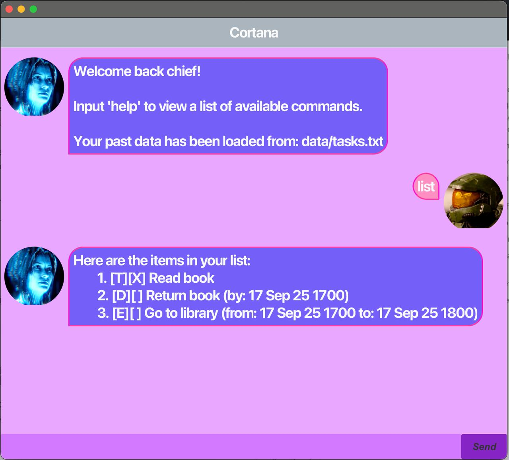

# Cortana User Guide

Cortana is a lightweight Java/Gradle CLI task manager that supports deadlines, searching, and basic task management. It validates and parses date/time input and prevents adding past deadlines.

## Quick Start \/ Installation

Follow these steps on macOS to build and run Cortana locally.

### Prerequisites
- Java: OpenJDK 17 (LTS) recommended. Set `JAVA_HOME` to the installed JDK:
    - `brew install openjdk@17`
    - `export JAVA_HOME=$(/usr/libexec/java_home -v17)`
- Git (to clone the repository)
- Gradle wrapper is included; no global Gradle install required.

### Clone
- `git clone <repository-url>`
- `cd <repository-directory>`

### Build
- Make the Gradle wrapper executable if needed:
    - `chmod +x gradlew`
- Build the project:
    - `./gradlew build`
- Build artifacts are placed in:
    - `build/libs/` (look for `*.jar`)

### Run
- From the project root (using the built jar):
    - `java -jar build/libs/<artifact-name>.jar`
- Or run via Gradle:
    - `./gradlew run`

### Run tests
- `./gradlew test`
- Test reports: `build/reports/tests/test/index.html`

### Storage / Data
- Persistent data is stored in `data/` in the project workspace.
- Ensure the running user has write permission to `data/`.
- To reset app data, stop the app and remove the `data/` directory:
    - `rm -rf data/`

### Common issues
- Permission denied running `./gradlew` \- run `chmod +x gradlew`.
- Wrong Java version \- confirm `java -version` and `echo $JAVA_HOME`.
- If the app cannot read/write storage, check directory permissions for `data/`.

### Run from IntelliJ IDEA
- Open the project (`build.gradle`).
- Let IntelliJ import Gradle.
- Run the `main` application configuration or use `./gradlew run` from the integrated terminal.

## Commands

This section documents all CLI commands supported by Cortana.

### 1\. Add (todo, deadline, event)

Add tasks with one of three subcommands.

Usage:
- `todo <description>`
- `deadline <description> /by <dateString>`
- `event <description> /at <dateString>`

Examples:
- `todo Read chapter 5`
- `deadline Submit report /by 17 9 25 1800`
- `event Team meeting /at 20 Sep 25 1400`

Date parsing notes (for `deadline` and `event`):
- Supported formats: `dd M yy HHmm` (e.g. `17 9 25 1800`) and `dd MMM yy HHmm` (e.g. `17 Sep 25 1800`).
- Two\-digit years map to 2000–2099 (so `25` -> `2025`).
- Whitespace is normalized (extra spaces are tolerated).
- If parsing fails the app throws: `Invalid date or date format. Use dd M yy HHmm or dd MMM yy HHmm`.
- If the parsed date/time is before now the app throws: `Date/time cannot be in the past.`

### 2\. Mark / Unmark

Mark a task as done or not done by its id.

Usage:
- `mark <id>` — marks the task with the given id as completed.
- `unmark <id>` — marks the task with the given id as not completed.

Example:
- `mark 3`
- `unmark 3`

Note:
- Task ids are 1-based and correspond to the order shown in the `list` command.

### 3\. Delete

Remove a task by its id shown in the `list` command.

Usage:
- `delete <id>` — deletes the task with the given id.

Example:
- `delete 2`

Behavior:
- Removes the task from the in-memory list and updates persistent storage immediately.
- Task ids are 1-based and correspond to the order shown by `list`.
- On success the app prints a confirmation and the removed task details, e.g. `Deleted task: 2. [T][ ] Read chapter 5`.
- If the id is out of range or invalid the app prints: `Invalid task id.`

Notes:
- Task ids may change after deletions since they are based on the current list order.
- Task ids are 1-based.
- Deletions are permanent unless you have a manual backup of the storage file (commonly in `data/` or the configured storage path).

### 4\. Find

Search tasks by keyword. The search checks the string representation of each task.

Usage:
- `find <keyword>`

Behavior:
- Performs a substring match across `task.toString()` output (`anyMatch(task.toString()::contains)`), so matches can be found in the string representation of the task

Example:
- `find project` — matches tasks whose String representation contains `project`.

### 5\. List

Show all tasks with their ids, types, statuses and details.

Usage:
- `list`

Example output:
- `1. [D][ ] Submit report (by: 17 SEP 2025 1800)`
- `2. [T][X] Read chapter 5`

### 6\. Help

Display brief usage instructions for available commands.

Usage:
- `help`

This prints command summaries and examples to the console.

### 7\. Exit

Save current data and exit the application.

Usage:
- `bye`

The application persists task data before quitting so the task list is available on next start.

## Storage of data

Persistent storage details:
- Tasks are persisted to a local file in the project workspace so data survives between runs.
- The storage implementation creates and reads the storage file on startup and saves on changes / exit. Ensure the workspace allows file writes.
- If you need to relocate or inspect the storage file, check the project's storage component or configuration for the exact path (`data/` directory).

## Contributing

- Project is Java with Gradle. Tests and build tasks are run via Gradle.
- Place `Ui.png` in `docs/` so the image renders in `docs/README.md` (reference shown above).

## Acknowledgements

This README was drafted with assistance from GitHub Copilot. Further modifications were made. Learn more at https://docs.github.com/en/copilot
